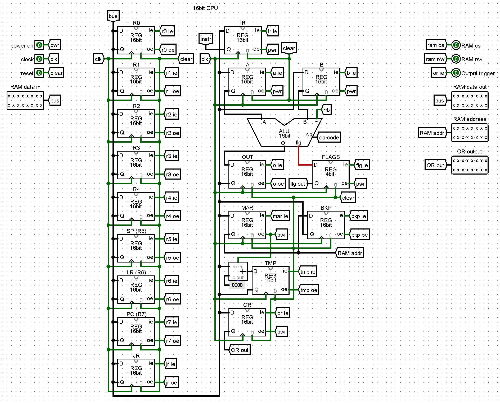

# RC16 - a 16bit RISC computer

RC16 is a 16bit RISC computer which features a well-designed hardware, implemented in Logisim, and its own assembler, written in C++.

# Usage

First of all run `make` in order to install the RC16 Compiler. Next, you need to write a working program. Some examples can be found in the relative folder. Once done that, run `rcc -i file.rc -o file.bin` to compile your program. Finally, open Logisim and load the generated `file.bin` fine into the RAM module. To execute the program, toggle the `power` switch in the main view and hit `Ctrl-k`.

# Assembly syntax

There are few, strict rules:
 - There are two sections, the `.data` and `.prgm` ones. Data sections must come before the program section.
 - Labels are formatted as `&label` and followed by a `=` sign if the data is on the same line (this can be done only in `.data` section!).
 - Every instruction is formatted as follows: `instr: arg1, arg2, arg3`. Every instruction is made of 3 letters, followed by an `s` if you want to update the flags (allowed only in operation that involve the ALU), followed by an optional conditional (two letters).
 - Comments can be written with a trailing `#`.
 - BE CAREFUL! When using the `put` command, the loaded address MUST be declared inside the `.data` section.

# License

This software is licensed under the Creative Commons Attribution-NonCommercial-ShareAlike 4.0 License.

